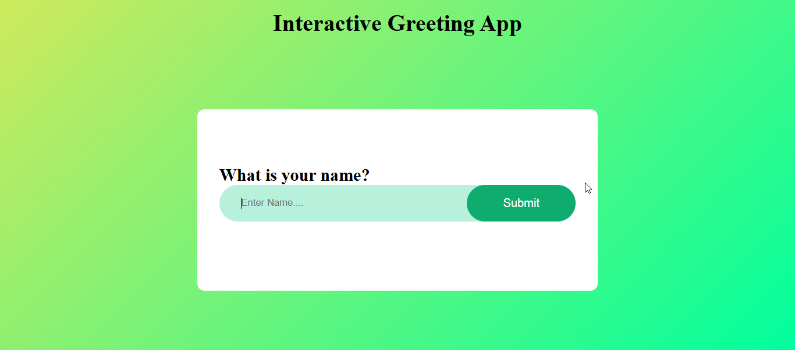

### Project 1: Interactive Greeting App

```markdown
# Interactive Greeting App


## 📋 Description

A simple, interactive greeting application that takes a user's name and displays a personalized greeting message with time-based salutations (Good Morning/Afternoon/Evening).

**Live Demo:** [View Live](https://alig487.github.io/js-project-01-greetingApp/)

## ✨ Features

- ✅ Input field for user name
- ✅ Real-time greeting generation
- ✅ Time-based greetings (Morning/Afternoon/Evening)
- ✅ Responsive design
- ✅ Input validation
- ✅ Clear button functionality

## 🎯 Technologies Used

- **HTML5** - Page structure
- **CSS3** - Styling
- **Vanilla JavaScript** - DOM manipulation and logic

## 📸 Screenshot



```

## 🚀 Quick Start

```bash
# Clone the repository
git clone https://github.com/AliG487/js-project-01-greetingApp
cd js-project-01-greetingApp

# Open in browser
# Method 1: Direct open
open index.html

# Method 2: Using Python server
python -m http.server 8000
# Visit http://localhost:8000

# Method 3: VS Code Live Server
# Right-click index.html → Open with Live Server
```

## 📖 How to Use

1. Open the application in your browser
2. Enter your name in the input field
3. Click "Submit" or press Enter
4. See your personalized greeting!
5. Greeting changes based on time of day:
   - Before 12 PM: "Good Morning!"
   - 12 PM - 6 PM: "Good Afternoon!"
   - After 6 PM: "Good Evening!"

## 🎓 Key Concepts Learned

- **DOM Manipulation** - How to select HTML elements and modify their content
- **Event Listeners** - Handling click and keypress events
- **String Methods** - Trimming input and concatenating strings
- **Date Objects** - Getting current hour to determine time-based greeting
- **HTML Forms** - Creating and handling form inputs

## 🔄 Challenges Faced

**Challenge**: Handling empty input gracefully

```javascript
const name = nameInput.value.trim()

if (name === "") {
  greeting.textContent = "Please enter your name!"
  return
}
```

**Challenge**: Making greeting change based on time of day

```javascript
function messageGen() {
  const hour = new Date().getHours()
  if (hour >= 5 && hour < 12) {
    return "Good Morning"
  } else if (hour >= 12 && hour < 17) {
    return "Good Afternoon"
  } else if (hour >= 17 && hour < 21) {
    return "Good Evening"
  } else {
    return "Good Night"
  }
}
```

## 📚 Files Explained

- `index.html` - HTML structure with input field and greeting display
- `style.css` - Styling with gradient background
- `script.js` - JavaScript logic for greeting functionality

## ✅ Features Breakdown

| Feature               | Implementation                              |
| --------------------- | ------------------------------------------- |
| Input handling        | `querySelector()` and `value` property      |
| Greeting generation   | String concatenation with template literals |
| Time-based salutation | `getHours()` method with conditional logic  |
| Clear input           | Set `value = ''` after submission           |

## 🔮 Future Improvements

1. **Add name validation** - Check for numbers or special characters
2. **Store name in localStorage** - Remember user's name
3. **Sound effects** - Add audio when greeting appears
4. **Multiple languages** - Support for different languages
5. **Emoji selection** - Let users choose custom emojis
6. **Dark mode** - Add theme toggle

## 🎯 Learning Outcomes

This project helped me understand:

- ✅ How to manipulate the DOM with JavaScript
- ✅ How event listeners work
- ✅ How to work with the Date object
- ✅ Proper input validation
- ✅ Basic form handling

## 📝 License

MIT License - Feel free to use this project!

## 👨‍💻 Author

**Gohar Ali**

- GitHub: [@AliG487](https://github.com/AliG487)

- Email: engr.ali487@gmail.com

---

Made with ❤️ by Gohar Ali
